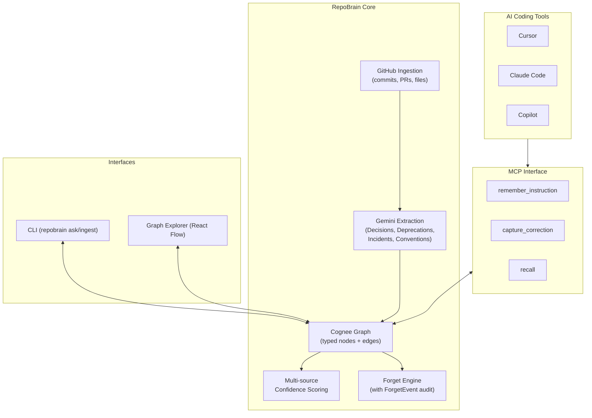

# RepoBrain

**Every AI coding tool has amnesia. RepoBrain is the memory layer they all plug into.**

A knowledge graph of your team's decisions, deprecations, incidents, and conventions —
queried by any AI coding tool via MCP, so Cursor stops suggesting Redis after you removed it
and Claude stops recommending Jest after you migrated to Vitest.

<!-- SCREENSHOT: graph explorer hero shot -->

## The problem

You use Cursor. You use Claude. You use Copilot. Every one of them was built on billions of
GitHub repos and has zero idea what your specific team decided last week.

So you correct them. The same correction. In every new chat. Every session. Forever.

- AI suggests Redis after you removed it 6 months ago
- AI writes Express middleware for your Fastify project
- AI recommends Jest after your team migrated to Vitest
- AI uses the old auth pattern after the security incident that forced the new one

## What RepoBrain does

RepoBrain turns your repo's history into a queryable memory graph, then makes that graph
available to any AI coding tool through a standard interface.

- **Ingest any GitHub repo** — commits, PRs, decisions, deprecations, incidents extracted into a typed knowledge graph
- **Query the graph via CLI or MCP** — get answers with multi-source confidence scoring
- **Any AI coding tool plugs in via MCP** — Cursor, Claude Code, Cline, Continue
- **Forget stale memories** with a visible audit trail

## All four memory operations, first-class

RepoBrain implements the complete memory lifecycle — remember, recall, improve, and forget:

| Operation | How RepoBrain does it |
|---|---|
| **remember()** | `repobrain ingest` turns commits, PRs, and branches into typed nodes with real edges; `remember_instruction` (MCP) stores standing instructions from any AI tool |
| **recall()** | `repobrain ask` and the `recall` MCP tool synthesize answers from multiple memories, with per-source citations, confidence scoring, and branch-divergence detection |
| **improve()** | `capture_correction` (MCP) turns every "no, we use Fastify, not Express" into a first-class Correction node — corrected once, recalled by every connected tool, in every future session. Confidence strengthens as independent memories accumulate |
| **forget()** | `preview_forget` → `forget_memories` removes stale memories behind a tuned relevance threshold, and records every deletion as an audit **ForgetEvent** — the graph knows what it forgot, and why |

## How it's different

- **Typed knowledge graph, not a vector dump.** Custom `DataPoint`s (`Decision`, `Deprecation`, `Incident`, `Convention`, `UserInstruction`, `Correction`, `ForgetEvent`, plus structural nodes) with real object-reference edges between them.
- **Multi-source confidence.** Answers cite their sources; HIGH confidence means 3+ independent nodes agree; LOW confidence is honest, not hedged.
- **Branch-aware.** RepoBrain knows which branch a decision lives on and surfaces divergence between branches.
- **Forget is first-class.** Removing stale memories creates an audit `ForgetEvent` — the graph knows what was removed and why.
- **Built on Cognee — the deep way.** Uses the open-source Cognee SDK's low-level API (`add_data_points`, `GraphCompletionRetriever`) with custom typed schemas and deterministic identity-based node IDs, not the high-level RAG wrapper. Forget relevance filtering surfaces cosine vector distances Cognee computes internally but doesn't expose.

## Demo walkthrough

<!-- SCREENSHOT: graph explorer with query bar + hovered node -->

Every commit, PR, decision, and deprecation is a typed node. Real edges connect them. Hover to explore.

<!-- SCREENSHOT: CLI ask with HIGH confidence + 3 sources -->

Ask a question. Get an answer synthesized from multiple sources, with confidence signals showing how many independent memories agree.

<!-- SCREENSHOT: ForgetPanel with red-tinted preview -->

Search for stale memories. See what will be removed. Forget them with a recorded reason — the audit trail lives in the graph.

## Architecture



## Getting started

### Requirements

- Python 3.12+
- Node 20+
- A Gemini API key ([get one](https://aistudio.google.com/apikey))
- A GitHub personal access token

### Setup

```bash
# 1. Clone and install
git clone https://github.com/Bobbywantsclout/repobrain.git
cd repobrain
python -m venv .venv
.venv\Scripts\activate  # Windows | source .venv/bin/activate  # Mac/Linux
pip install -e .

# 2. Copy env template and add your keys
cp .env.example .env
# Edit .env — set GEMINI_API_KEY and GITHUB_TOKEN

# 3. Ingest a repo
repobrain ingest https://github.com/vercel/ms --branches main,paul/use-vitest

# 4. Ask questions
repobrain ask "what security issues has this project had"

# 5. Explore the graph
uvicorn backend.main:app --reload  # in one terminal
cd frontend && npm install && npm run dev  # in another
# Open http://localhost:3000
```

### Optional: connect to your AI coding tool via MCP

RepoBrain ships with a working MCP server in `mcp_server/repobrain.py`, exposing three tools:
`remember_instruction`, `capture_correction`, and `recall`. To connect it to Claude Code, add to
your `.mcp.json`:

```json
{
  "mcpServers": {
    "repobrain": {
      "command": "<absolute path>/.venv/Scripts/python.exe",
      "args": ["<absolute path>/mcp_server/repobrain.py"]
    }
  }
}
```

## Roadmap

Today RepoBrain has the memory layer, the graph explorer, and the CLI/MCP interfaces. What's next:

- **Native editor extensions** — VS Code and Cursor overlays that surface relevant memory inline as you type, without needing an MCP call
- **Continuous sync** — GitHub webhook receiver so the graph stays live as commits and PRs land, no re-ingest needed
- **Branch-aware merge tracking** — detect when feature-branch decisions get promoted to main, and provenance through the merge
- **Team memory** — multi-user access control so a company's shared RepoBrain can serve every developer
- **Cognee Cloud integration** — hosted graph + embeddings + inference, so teams don't manage infrastructure

## What we built this for

Built for the WeMakeDevs × Cognee **"Hangover Hackathon"** (June 2026). We felt the pain we're
solving: this entire project was built with Claude Code, and every time it forgot a decision
we'd made two hours earlier, we felt the exact gap RepoBrain fills. Our AI woke up with no
memory of last night — so we built it a brain that doesn't forget.

Built on the open-source [Cognee SDK](https://github.com/topoteretes/cognee) — using the
low-level `add_data_points` + `GraphCompletionRetriever` APIs with custom typed schemas rather
than the high-level RAG wrapper.

## Built with

- [Cognee](https://github.com/topoteretes/cognee) — the open-source knowledge graph SDK powering the memory layer
- [FastAPI](https://fastapi.tiangolo.com/) — Python API framework
- [Next.js](https://nextjs.org/) — React framework for the graph explorer
- [React Flow](https://reactflow.dev/) — graph visualization library
- [d3-force](https://d3js.org/d3-force) — physics simulation for the graph layout
- [Gemini](https://ai.google.dev/) — extraction and embeddings

## License

MIT. See [LICENSE](LICENSE) for the full text.
